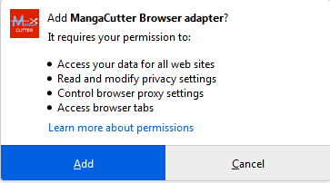
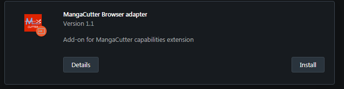

# Installation of MangaCutter Browser Adapter

The easiest way to install Browser Adapter in your browser is to download a proper version of extension
from [Releases](https://github.com/MangaCutter/MangaCutter/releases). Usually browser will automatically install new
extension. So you will only need to accept your intention. Below you can see detailed description of installation
process for well-known browsers.

Browser Adapter needs ports 50000 and 50001 to be free.

After this you can add MangaCutter root CA to your browser ([How-To](how-to-add-root-ca.md))

## Mozilla Firefox

1. Open [Releases](https://github.com/MangaCutter/MangaCutter/releases) page and find in Assets
   file `MangaCutter-firefox.xpi`.
2. Download it using Firefox.
3. Firefox will automatically recognise that you want to install Brwoser Adapter.

   
4. Click `Add` button.
5. Congratulations! you have successfully installed MangaCutter Browser Adapter.

## Opera

1. Open [Releases](https://github.com/MangaCutter/MangaCutter/releases) page and find in Assets
   file `MangaCutter-opera.crx`.
2. Download it using Opera.
3. Opera will show a notification that this extension is unknown.

   
4. Open [extensions page](opera://extensions)
5. Here you will see disabled extension.
   
   
6. Click `Install` button.
7. Congratulations! you have successfully installed MangaCutter Browser Adapter.

## Google Chrome

Now we have some troubles with packing of Browser Adapter extension in Chrome easily, so you will have to do some
additional actions.

1. Open [Releases](https://github.com/MangaCutter/MangaCutter/releases) page and find in Assets
   file `MangaCutter-chrome.zip`.
2. Download it.
3. Extract files to any empty directory.
4. Open [extensions page](chrome://extensions/) in Google Chrome.
5. Enable `Developer mode` in upper right corner.

   
6. Click `Load unpacked` button and select directory that contains extracted extension files.

   
7. Congratulations! If you can see MangaCutter Browser Adapter panel then you have successfully installed Browser
   Adapter.