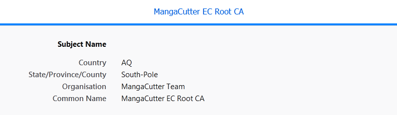
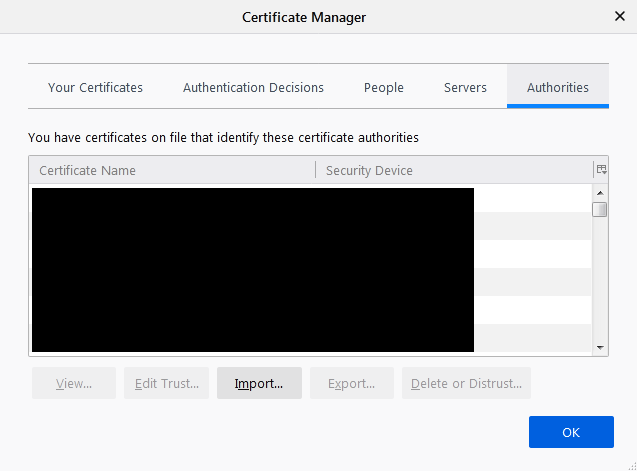
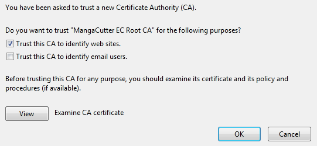
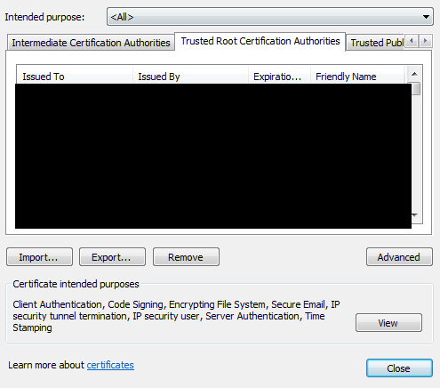
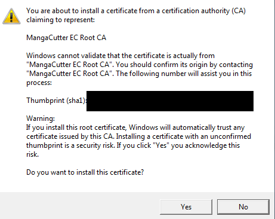
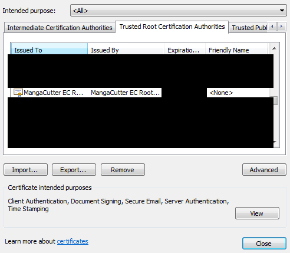

# Установка корневого сертификата MangaCutter

Установленный [Корневой сертификат:en](https://en.wikipedia.org/wiki/Root_certificate) используется MangaCutter для
расшифровки трафика, который проходит через MangaCutter в Интернет. Это ключевой элемент модуля получения изображений,
поэтому установка корневого сертификата обязательна для работы с расширением для браузера.

## !!!ВНИМАНИЕ!!!

Не показывайте никому закрытую часть корневого сертификата(строку закодированную в Base64 в
настройках `Центр сертификации`). Хакеры смогут получить доступ ко всем вашим действиям в сети, если у них будет
закрытая часть корневого сертификата, как это получается у MangaCutter. В случае утечки немедленно удалите из системы
скомпрометированный корневой сертификат!!!

По этой причине вы должны создавать корневой сертификат отдельно на каждом компьютере. Он будет в безопасности, если вы
не занесёте на компьютер никаких вирусов. MangaCutter или любая другая обычная программа не могут отправить в интернет
созданный корневой сертификат.

## Общие шаги

1. Откройте MangaCutter.
2. Откройте `Плагин > Сгенерировать новый сертификат`
3. Выберите путь сохранения для открытой части корневого сертификата.
4. Теперь импортируйте созданный файл в ваш браузер. Подробности для известных браузеров ниже.
5. Теперь вы можете установить Расширения для браузера MangaCutter ([Инструкция](how-to-install-extension.md))

## Mozilla Firefox

5. Откройте настройки [Приватность и защита](about:preferences#privacy).
6. Нажмите кнопку `Просмотр сертификатов...`.

   
7. Перейдите на вкладку `Центры сертификации`.

   
8. Нажмите кнопку `Импортировать...` и выберите раннее созданный crt-файл.
9. Выставите галку `Доверять при идентификации веб-сайтов`.

   
    + (Дополнительно) Сравните отпечаток SHA-1 из сообщения MangaCutter с отпечатком во вкладке `Посмотреть`. ОНИ ДОЛЖНЫ
      СОВПАДАТЬ.
10. Нажмите кнопку `OK`.

    
11. Поздравляем! Вы успешно импортировали корневой сертификат MangaCutter в Firefox.

## Opera и Google Chrome

5. Откройте окно `Сертификаты` в браузере.
    + В Opera: Перейдите на вкладку [Безопасность](opera://settings/security) и откройте ссылку `Настроить сертификаты`.
    + В Chrome: Перейдите на вкладку [Безопасность](chrome://settings/security) и откройте
      ссылку `Настроить сертификаты`.
6. Перейдите на вкладку `Доверенные корневые центры сертификации`.

   
7. Нажмите кнопку `Импорт` и `Далее`.
8. Выберите раннее созданный crt-файл и нажмите кнопку `Далее`.
9. Выберите хранилище сертификатов как на картинке ниже и нажмите `Далее`.

   
10. Проверьте поля и нажмите кнопку `Готово`.
    + (Дополнительно) Сравните отпечаток SHA-1 из сообщения MangaCutter с отпечатком `Предупреждении о безопасности`.
      ОНИ ДОЛЖНЫ СОВПАДАТЬ.

      
11. Нажмите кнопки `Да` и `OK`.

    
12. Поздравляем! Вы успешно импортировали корневой сертификат MangaCutter в Opera и Chrome.